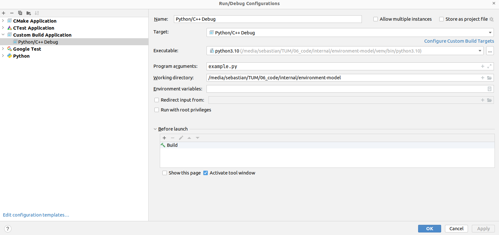

## Python Interface

### Installing the Binary Wheels
Wheels are pre-built binary Python packages that save you the time of building
the Environment Model yourself. We automatically build these wheels for releases.

At the time of writing, the wheels are not yet available on PyPI, so you'll have
to instruct pip to download the packages from the Gitlab package repository.
You'll probably need to set up a Gitlab personal acces token first
if you don't already have one.

For each available package listed in the [package registry](https://gitlab.lrz.de/maierhofer/environment-model/-/packages),
Gitlab provides instructions on how to install it.
For example, the following command should automatically select and
install the most recent Environment Model version (replace `<your_personal_token>`
with your personal access token):
```
pip install commonroad-cpp --extra-index-url https://__token__:<your_personal_token>@gitlab.lrz.de/api/v4/projects/63826/packages/pypi/simple
```

#### Wheel Support Status

The following matrix shows the supported status for each combination of
platform and Python version.
If you're not sure which platform  you have, it will most likely be the
most common one, `manylinux-x86_64`.
In any case, don't worry about selecting the right wheel type as pip will automatically
figure that out. In case binary wheels are not (yet) available for your platform,
pip will build the package from source which might take a while.

Wheels are not built for Windows or macOS at the moment.

| Python version | manylinux-x86_64 | manylinux-i686 | musllinux-x86_64 | musllinux-i686
|----------------| :-----------: | :-----------: | :-----------: | :-----------: |
| 3.7 or earlier | ✗ | ✗ | ✗ | ✗ |
| 3.8            | ✓ | ~ | ~ | ~ |
| 3.9            | ✓ | ~ | ~ | ~ |
| 3.10           | ✓ | ~ | ~ | ~ |
| 3.11           | ✓ | ~ | ~ | ~ |

Legend:
| symbol | description |
| :---: | ----- |
| ✓ | built and tested |
| ~  | built but not tested (known issues) |
| ✗ | not supported |

#### Using the Python Module in Anaconda

No special steps are required in order to use the package with Anaconda.

### Build Instructions for the Python Module
In general, the following command should be sufficient to build the Python module:
```
pip install .
```

You might want to add the verbose flag `-v` in order to see some build output.
Without it, the build might appear to be stuck
(`Building wheel for commonroad-cpp (pyproject.toml) ...`).
```
pip install -v .
```

#### Caveat: Deprecated Commands
**Do not use** bare `setup.py` invocations like the following:
```bash
python setup.py install
```
They do not consider modern Python packaging standards and can cause various issues.

#### Accelerating Repeated Builds
It is possible to significantly speed up repeated builds
of the Python module by specifying the `--no-build-isolation` flag:
```
pip install -v --no-build-isolation .
```
This is completely optional. It might require some additional steps outlined below.

Explanation: When build isolation is enabled (default in recent pip versions),  
pip will provide the Python interpreter files in a temporary directory.
The name of the temporary changes for every invocation of `pip install` even if the files are identical.
Therefore, CMake will decide to reconfigure the project, requiring recompilation of all source files.
By disabling build isolation for development builds, CMake won't need to reconfigure as the paths to the 
Python installation stay the same. 
Therefore, CMake can reuse files from the previous build, making it the build faster.

However, if you want to use `--no-build-isolation` you need to ensure all
Python build requirements (PEP 518 requirements) as specified in
`pyproject.toml` are already installed.
To install them, run the following:
```
pip install "setuptools>=61.0" "wheel" "scikit-build~=0.15.0" "cmake~=3.24.0" "ninja" "pybind11~=2.10.0" "setuptools_scm[toml]>=6.2"
```

### Working with the environment-model in Python
The subsequent code snippet shows important functions needed for using the predicates within Python:
```Python
import commonroad_cpp
...
cpp_env_model.register_scenario(123, 0, lanelet_network, [obstacle_2, obstacle_3], [obstacle_1])

print("Safe Distance satisfied: {}".format(cpp_env_model.in_same_lane_boolean_evaluation(123, 4, 1, 3)))

cpp_env_model.remove_scenario(123)
```
Other predicates can be executed analgously.  
It is necessary to register and remove each scenario before and after using the predicates.   
You can also take a look at the Python test cases for further examples.

For debugging the Python interface you can use the methods described [here](https://www.jetbrains.com/help/clion/debugging-python-extensions.html#debug-custom-py) (Option 2).   
For example, here are two screenshots of a working configuration:    
   
   
  
**Note that the correct Python environment must be selected several times!**