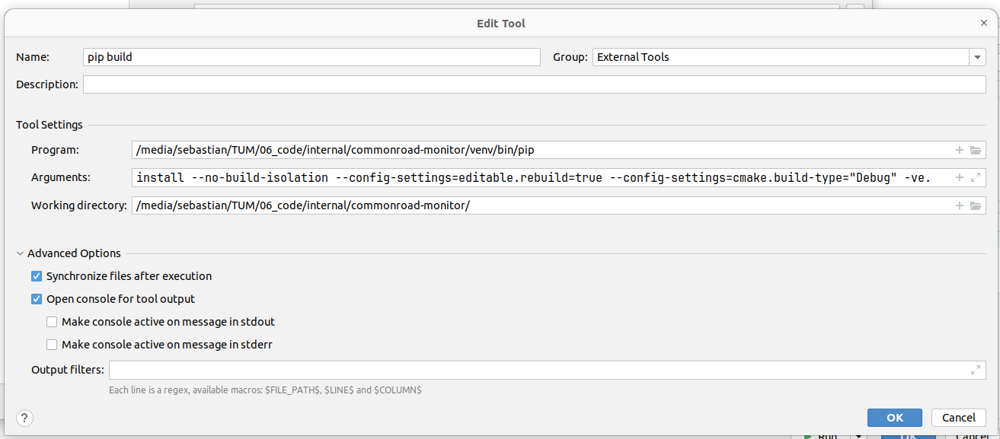

## Python Interface

### Build Instructions for the Python Module
In general, the following command should be sufficient to build the Python module:
```
pip install .
```

You might want to add the verbose flag `-v` in order to see some build output.
Without it, the build might appear to be stuck
(`Building wheel for commonroad-cpp (pyproject.toml) ...`).
```
pip install -v .
```

#### Caveat: Deprecated Commands
**Do not use** bare `setup.py` invocations like the following:
```bash
python setup.py install
```
They do not consider modern Python packaging standards and can cause various issues.

#### Accelerating Repeated Builds
It is possible to significantly speed up repeated builds
of the Python module by specifying the `--no-build-isolation` flag:
```
pip install -v --no-build-isolation .
```
This is completely optional. It might require some additional steps outlined below.

Explanation: When build isolation is enabled (default in recent pip versions),  
pip will provide the Python interpreter files in a temporary directory.
The name of the temporary changes for every invocation of `pip install` even if the files are identical.
Therefore, CMake will decide to reconfigure the project, requiring recompilation of all source files.
By disabling build isolation for development builds, CMake won't need to reconfigure as the paths to the 
Python installation stay the same. 
Therefore, CMake can reuse files from the previous build, making it the build faster.

However, if you want to use `--no-build-isolation` you need to ensure all
Python build requirements (PEP 518 requirements) as specified in
`pyproject.toml` are already installed.
To install them, run the following:
```
pip install "setuptools>=61.0" "wheel" "scikit-build-core~=0.6.0" "pybind11~=2.11.1" "setuptools_scm[toml]>=7.1.0"
```

### Debugging the C++ interface codr from Python
For debugging the Python interface you can use the methods described [here](https://www.jetbrains.com/help/clion/debugging-python-extensions.html#debug-custom-py) (Option 2).   
For example, here are two screenshots of a working configuration:    
   
   
  
**Note that the correct Python environment must be selected several times!**